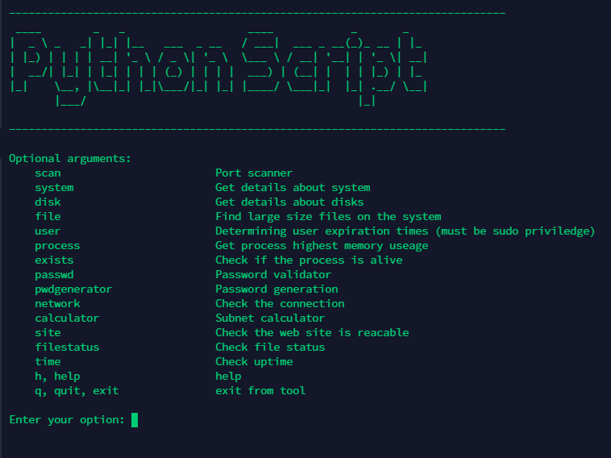

__Python scripting__
================================

Python script that includes many functions as Command Line Tool

__Functionality__
------------
* Port scanner
* Subnet calculator
* Functions for get details about system, disks
* Functions for file, user and process operations
* Password validator and generator

__Requirements__
------------
* Python 3.8.10

Dependencies
------------
* Requires elevated root privileges
* Requires internet connection to download the necessary python modules

Note
------------
Many useful python libraries were used for the script. Some functions are based on articles and videos. The functions in the Modules folder can also be used separately.

Running the script
----------------------

__To Run__

`python3 tool.py`

__Author Information__
------------------

Samir Nabadov
